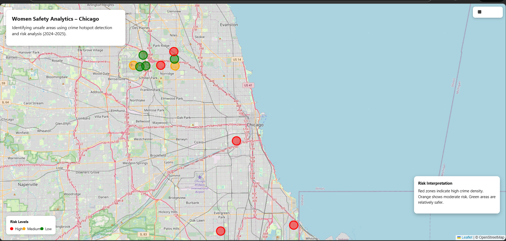
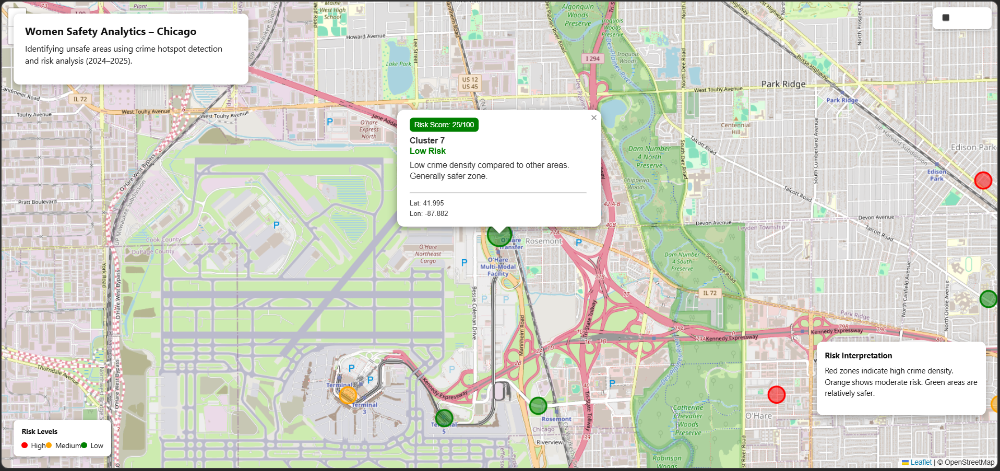
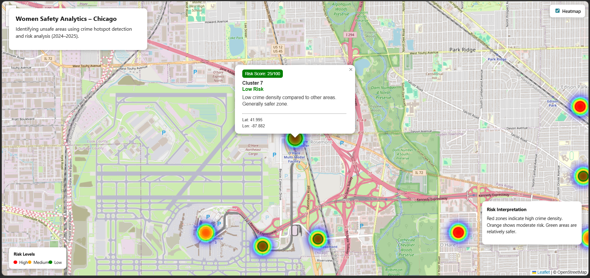

# 🛡️ Women Safety Analytics – Chicago Crime Hotspot Detection

## 📌 Overview
**Women Safety Analytics** is a geospatial crime analysis project that identifies **unsafe areas in Chicago** using historical crime data (2024–2025).  
The system applies **density-based clustering (DBSCAN)** to detect crime hotspots and assigns **interpretable risk levels and scores**, visualized through an **interactive, mobile-responsive map**.

This project emphasizes **real-world usability, explainability, and correct algorithm selection**, making it suitable for safety awareness, urban analytics, and decision support.

---
## 🌐 Live Deployment

### 🔹 Frontend (Live UI)
https://women-safety-analytics-tawny.vercel.app

### 🔹 Backend API
https://women-safety-backend-p05p.onrender.com

**Available Endpoints**
- `/api/risk/clusters` → Crime hotspot clusters
- `/api/risk/centroids` → Cluster centroids with risk levels

> ⚠️ Backend is hosted on a free tier and may take ~30 seconds to wake up on the first request.

---

## 🎯 Key Features

- 📍 Crime hotspot detection using **DBSCAN clustering**
- 🌙 Night-time crime consideration in risk analysis
- 🚦 Risk classification: **High / Medium / Low**
- 🔢 **Risk score (0–100)** for each hotspot
- 🔥 Heatmap visualization for crime density
- 🔍 Zoom & highlight clusters on click
- 🗺️ Interactive Leaflet map
- 📱 Fully mobile-responsive UI
- ℹ️ Clear risk explanations via popups

---

## 🧠 Methodology

### 1️⃣ Data Preparation
- Used **Chicago Crime Dataset (2024–2025)**
- Removed missing latitude/longitude values
- Extracted time-based features (hour, night flag)
- Sampled dataset for efficient processing

### 2️⃣ Clustering
- Applied **DBSCAN** with **Haversine distance**
- DBSCAN was chosen because:
  - No need to predefine number of clusters
  - Handles spatial density effectively
  - Naturally identifies noise points

### 3️⃣ Risk Scoring
- Each cluster assigned a risk level based on:
  - Crime density
  - Night-time activity
- Converted into an interpretable score:
  - High Risk → ~85
  - Medium Risk → ~55
  - Low Risk → ~25

### 4️⃣ Visualization
- Cluster centroids plotted on map
- Color-coded markers (Red / Orange / Green)
- Heatmap overlay for density comparison
- Interactive popups with explanations and scores

---

## 🧩 Tech Stack

### 🔹 Data & Analytics
- Python
- Pandas
- NumPy
- Scikit-learn (DBSCAN)
- Haversine distance

### 🔹 Backend
- Node.js
- Express.js
- REST APIs

### 🔹 Frontend
- React
- React-Leaflet
- Leaflet.js
- OpenStreetMap tiles

---

## 🖥️ Application Flow

1. Crime data is cleaned and clustered offline
2. Cluster centroids and risk levels are stored
3. Backend exposes data via REST API
4. Frontend fetches and visualizes clusters
5. Users interact with map to explore risk zones

---

## 📊 Insights

- High-risk clusters show strong night-time crime density
- Heatmaps reveal patterns not obvious from markers alone
- Some unsafe zones exist outside central city areas

---

## ⚠️ Limitations

- Based on historical data only
- Risk is **relative**, not predictive
- Crime severity is not weighted
- No real-time data integration

---

## 🚀 Future Enhancements

- Time-based risk forecasting
- Crime type severity weighting
- User location-based safety alerts
- PDF/CSV safety report export
- Real-time data integration

---

## 📸 Screenshots
_Add screenshots here (map view, heatmap, popup example)._

---

## 🧑‍💻 Author
**Avisha Sahu**  
B.Tech Computer Science Engineering

---

## 🏁 Final Note
This project demonstrates **applied machine learning, geospatial analytics, and full-stack development**, with emphasis on **correct algorithm choice, explainability, and real-world usability**.
